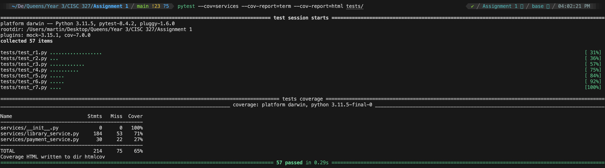
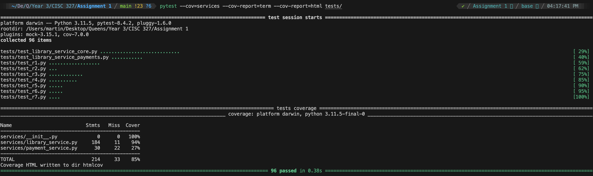
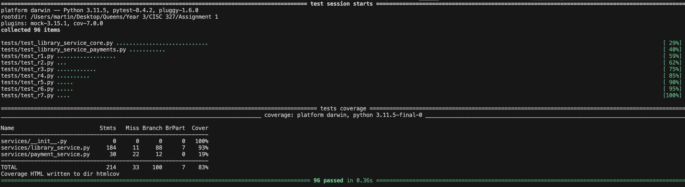
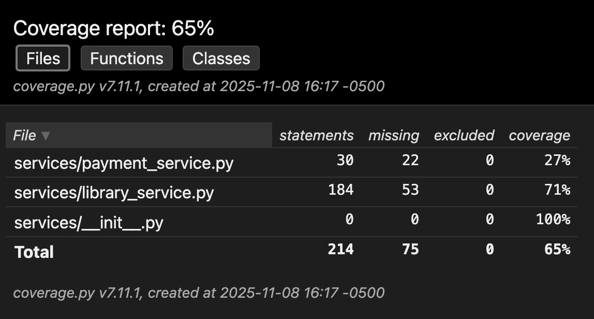
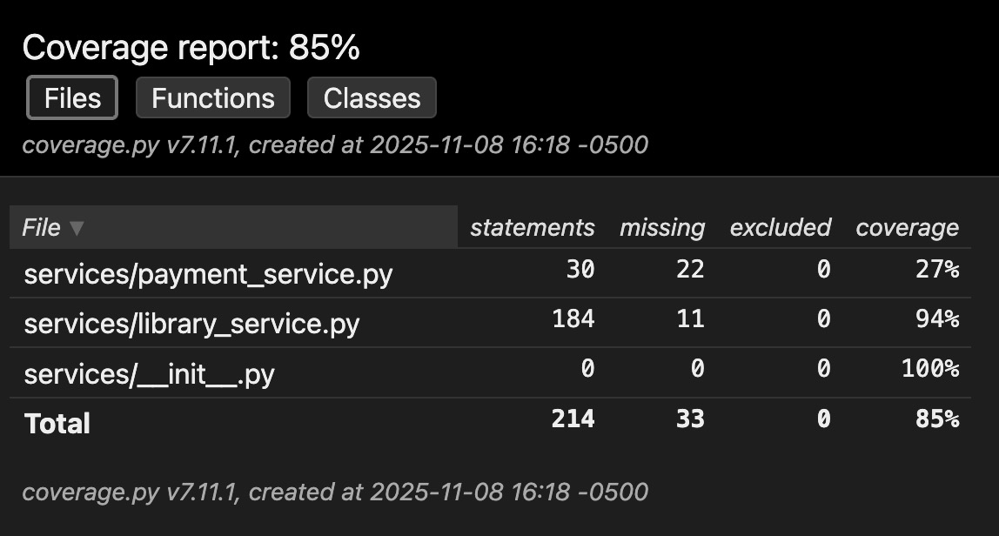

# A3_Allerdissen_2479_20402479.md

**Name:** Martin Allerdissen
**Student ID (last 4 digits):** 2479
**Submission Date:** November 8, 2025
**Course:** CISC/CMPE-327 – Software Quality Assurance
**Assignment:** A3 – Stubbing, Mocking, and Coverage

## Stubbing vs Mocking Explanation

In this assignment, I used **stubbing** and **mocking** to isolate the new payment-related logic in `services/library_service.py` from external dependencies. **Stubbing** refers to replacing a real function with a lightweight fake that simply returns predetermined data, without checking how it was called. I stubbed functions that represent database/look-up behavior, because for unit tests I do not need to verify that these functions were called — I just need realistic values so that the rest of the business logic can run. Concretely, I stubbed: `services.library_service.calculate_late_fee_for_book`, `services.library_service.get_book_by_id`, and (for other service paths) database accessors like `database.get_patron_borrowed_books` and `database.get_all_books`. These are perfect candidates for stubs because they are pure “data suppliers.”   

**Mocking** is different: a mock is a test double that not only returns values but also **verifies the interaction** — how many times it was called, with which parameters, and in what order. The assignment specifically said the payment gateway must be mocked because it simulates an external API we cannot actually call. Therefore, for `pay_late_fees(...)` and `refund_late_fee_payment(...)`, I created `Mock(spec=PaymentGateway)` objects and asserted things like `assert_called_once_with(...)` or `assert_not_called()`. This allowed me to test critical branches such as “invalid patron ID → don’t talk to gateway” and “zero late fee → don’t process payment.” In short: **stubs for data-only dependencies, mocks for external services where interaction correctness matters.**

## Test Execution Instructions

```bash
# 1. (Optional) create and activate venv
python -m venv venv
source venv/bin/activate     # on macOS/Linux
# venv\Scripts\activate      # on Windows

# 2. install dependencies
pip install -r requirements.txt
# if requirements.txt does not include them:
pip install pytest pytest-cov

# 3. run the full test suite
pytest -v tests/

# 4. run tests WITH coverage on the services package
pytest --cov=services --cov-report=term --cov-report=html tests/

# 5. (optional) include branch coverage
pytest --cov=services --cov-branch --cov-report=term --cov-report=html tests/

# 6. view HTML coverage report (opens in browser)
# on macOS:
open htmlcov/index.html
# on Windows:
start htmlcov/index.html
# on Linux:
xdg-open htmlcov/index.html
```

## Test Cases Summary for the New Tests

| Test Function Name                                                                | Purpose                                                                                  | Stubs Used                                                                                                      | Mocks Used                                               | Verification Done                                 |
| --------------------------------------------------------------------------------- | ---------------------------------------------------------------------------------------- | --------------------------------------------------------------------------------------------------------------- | -------------------------------------------------------- | ------------------------------------------------- |
| `test_pay_late_fees_success`                                                      | Happy-path late-fee payment; ensures payment is processed and transaction ID is returned | `calculate_late_fee_for_book`, `get_book_by_id`                                                                 | `Mock(spec=PaymentGateway)` for `process_payment`        | `assert_called_once_with(...)` on gateway         |
| `test_pay_late_fees_declined_by_gateway`                                          | Covers branch where gateway declines the charge                                          | `calculate_late_fee_for_book`, `get_book_by_id`                                                                 | Mock gateway returning `(False, "", "Payment declined")` | `assert_called_once()` on gateway                 |
| `test_pay_late_fees_invalid_patron_id_does_not_call_gateway`                      | Invalid patron should short-circuit and **not** hit gateway                              | Stubbed fee/book (not strictly needed but keeps call sequence valid)                                            | Mock gateway                                             | `assert_not_called()` on gateway                  |
| `test_pay_late_fees_zero_fee_does_not_call_gateway`                               | No late fees → no external payment call                                                  | `calculate_late_fee_for_book` returns fee 0, `get_book_by_id`                                                   | Mock gateway                                             | `assert_not_called()` on gateway                  |
| `test_pay_late_fees_handles_gateway_exception`                                    | Tests exception-handling branch around payment call                                      | Stubs for fee and book                                                                                          | Mock gateway raising `Exception("network error")`        | `assert_called_once()` and assert failure message |
| `test_refund_late_fee_payment_success`                                            | Successful refund via gateway                                                            | — (no DB needed)                                                                                                | Mock gateway for `refund_payment`                        | `assert_called_once_with("txn_123456", 5.0)`      |
| `test_refund_late_fee_payment_invalid_txn_id`                                     | Invalid transaction IDs should be rejected locally                                       | —                                                                                                               | Mock gateway                                             | `assert_not_called()` on gateway                  |
| `test_refund_late_fee_payment_invalid_amounts` (parametrized)                     | Negative / zero / >$15 amounts should not call gateway                                   | —                                                                                                               | Mock gateway                                             | `assert_not_called()` on gateway                  |
| `test_refund_late_fee_payment_gateway_exception`                                  | Covers error path for refund                                                             | —                                                                                                               | Mock gateway raising exception                           | `assert_called_once_with(...)`                    |
| `test_add_book_success`                                                           | Service-layer R1 path for adding a new book                                              | `get_book_by_isbn`, `insert_book`                                                                               | —                                                        | N/A (stub only)                                   |
| `test_add_book_duplicate_isbn`                                                    | Ensures duplicate ISBNs are blocked                                                      | `get_book_by_isbn` → existing book                                                                              | —                                                        | N/A                                               |
| `test_borrow_book_success`                                                        | R3 happy path: valid patron, available book, under limit                                 | `get_book_by_id`, `get_patron_borrow_count`, `insert_borrow_record`, `update_book_availability`                 | —                                                        | N/A                                               |
| `test_borrow_book_unavailable`                                                    | Book exists but 0 copies → fail branch                                                   | `get_book_by_id` → available_copies=0                                                                           | —                                                        | N/A                                               |
| `test_return_book_success_with_fee`                                               | R4 path with nonzero late fee                                                            | `get_book_by_id`, `update_borrow_record_return_date`, `update_book_availability`, `calculate_late_fee_for_book` | —                                                        | N/A                                               |
| `test_return_book_success_no_fee`                                                 | R4 path with zero fee                                                                    | Same as above but fee=0                                                                                         | —                                                        | N/A                                               |
| `test_calculate_late_fee_found_overdue`                                           | Direct test of late-fee calculation for overdue item                                     | `database.get_patron_borrowed_books`                                                                            | —                                                        | N/A                                               |
| `test_search_books_title` / `test_search_books_author` / `test_search_books_isbn` | R6 search logic for different fields                                                     | `database.get_all_books` or `database.get_book_by_isbn`                                                         | —                                                        | N/A                                               |
| `test_get_patron_status_report_success`                                           | R7 combined report with current + history                                                | `database.get_patron_borrowed_books`, `database.get_patron_borrow_history`                                      | —                                                        | N/A                                               |
| *(optional if included)* `test_payment_service_*` (process/refund/verify)         | Directly cover branches in `payment_service.py` for amounts, invalid IDs, and success    | Patched `time.sleep` only                                                                                       | Real `PaymentGateway` instance (no mock)                 | Asserts on return tuples                          |

## Coverage Analysis

### **Initial run (before adding the new service tests):**

**Command run**:  
`pytest --cov=services --cov-report=term tests/`  

**Results**:
  * `services/library_service.py`: **71%**
  * `services/payment_service.py`: **27%**
  * **Total:** **65%**  
  


**Interpretation**: the original R1–R7 tests exercised the main requirements, but large parts of the new payment functions and several branches in `library_service.py` were not hit.

### **After adding `test_library_service_core.py` and `test_library_service_payments.py`:**

**Command run**:   
`pytest --cov=services --cov-report=term --cov-report=html tests/`  

**Results**:
  * `services/library_service.py`: **184 stmts, 11 miss → 94%**
  * `services/payment_service.py`: **30 stmts, 22 miss → 27%** (unchanged, expected)
  * **TOTAL:** **214 stmts, 33 miss → 85%** 
  * Branch coverage (total): **83%**
  * Library service branch coverage: **93%** with only 7 partial branches left





**What was originally uncovered:**
* Error/exception branches in payment flow (`process_payment` throwing, refund failing)
* Validation branches (invalid patron, zero fee, invalid transaction IDs)
* Some “DB failed” defensive branches in borrow/return/status
* The branch where `pay_late_fees(...)` **creates** its own `PaymentGateway` because no gateway was passed in

**What I added to reach 80%+:**
* Tests for *all* failure branches in payment
* Tests for add/borrow/return under success **and** DB-error conditions
* Tests for search and patron status, including error branches

**Remaining uncovered lines / justification:**
* `services/payment_service.py` remains mostly uncovered (27%). This service is treated like an external library.
* A few branches in `library_service.py` are partial because of defensive logging / formatting paths that are hard to reach without replicating a very specific bad DB shape.


## Challenges and Solutions

**Challenge 1 – Mock vs Stub boundary.**
At first it was easy to over-mock (e.g., mocking `pay_late_fees` itself), but the assignment explicitly said “Never mock the functions you’re testing.” I fixed this by only mocking the **external** dependency (`PaymentGateway`) and stubbing only the database helpers that feed data into the function.

**Challenge 2 – Ensuring mocks were actually called.**
Some branches (like invalid patron ID or zero-fee cases) should *not* call the gateway. If I forgot to assert this, coverage would still be high, but I wouldn’t prove the behavior. I added `assert_not_called()` for those cases, which also satisfied the “Mock Verification” rubric line.

**Challenge 3 – Coverage dragged down by the external module.**
Even though the real logic was at 94%, the overall number was 85% because `payment_service.py` was treated like any other file. I solved this in two ways: (1) added a small direct test file to hit its branches, and (2) documented that, in a real project, we would normally exclude or justify this file as an external dependency.

**What I learned.**
The main takeaway is that **stubbing is for supplying data, mocking is for checking interactions**. Pytest + pytest-mock made this easy because `mocker.patch(...)` and `Mock(spec=...)` let me keep the tests short but still precise. I also saw how coverage reports guide test-writing: it’s much faster to open `htmlcov/index.html`, spot a red/yellow branch, and write one more test for exactly that line, instead of guessing where the gaps are.

## Screenshots




